<div align="center">

# 📚 EduVerse — Interactive Learning Dashboard

### *A feature-rich, single-page e-learning platform built with vanilla HTML, CSS & JavaScript*

[](https://developer.mozilla.org/en-US/docs/Web/HTML)
[](https://developer.mozilla.org/en-US/docs/Web/CSS)
[](https://developer.mozilla.org/en-US/docs/Web/JavaScript)
[](https://fontawesome.com)
[](LICENSE)

> **EduVerse** is a comprehensive, interactive learning dashboard designed to give students a modern, feature-rich platform for managing their online education — all in a single self-contained HTML file with zero dependencies beyond a CDN icon pack.

</div>

---

## ✨ Features

| Feature | Description |
|---|---|
| 🌗 **Dark / Light Mode** | Toggle between a sleek dark theme and a clean light mode instantly |
| 📊 **Learning Dashboard** | Overview stats: Active Courses, Overall Progress %, Time Spent, Achievements |
| 📚 **My Courses** | Enrolled course cards with progress bars, ratings, lesson counts, and Continue/Start buttons |
| 📖 **Course Catalog** | Full course grid with status badges (New / Popular / Featured) across all 6 subjects |
| 📋 **Course Detail Modal** | Per-course lesson list with completion checkmarks and a "Continue Learning" CTA |
| 📈 **Progress Analytics** | Completion rate, streak counter, Course Distribution donut chart, Monthly Progress bar chart |
| 🏆 **Achievements** | Unlocked badges — Fast Learner, Perfect Score, 7-Day Streak |
| 📝 **Assignments** | Pending (overdue, upcoming) and Completed assignment tracker with scores |
| 📅 **Learning Calendar** | Month view calendar with Today's Schedule (live sessions, study groups, self-paced time) |
| ⚙️ **Settings** | Account profile edit, avatar upload, notification toggles, password change, Two-Factor Auth |
| 🔔 **Notifications** | Real-time bell badge with in-app alerts (Assignment Due, New Course, Achievement Unlocked) |
| 🔐 **Auth Modals** | Login / Sign Up modal with session persistence + Logout confirmation dialog |

---

## 🖥️ Tech Stack

EduVerse is a **zero-build, zero-backend** single-file application:

| Technology | Role |
|---|---|
| **HTML5** | Semantic page structure, modal dialogs, sidebar navigation |
| **CSS3** | CSS Custom Properties (design tokens), Flexbox / Grid layouts, smooth transitions |
| **Vanilla JavaScript** | SPA routing logic, DOM manipulation, chart rendering, localStorage persistence |
| **Font Awesome 6.4** | Icon library loaded from CDN |
| **Canvas API** | Donut chart (Course Distribution) and bar chart (Weekly Activity / Monthly Progress) |

No frameworks. No bundlers. No npm. Just open `index.html` and go.

---

## 🚀 Getting Started

### Prerequisites

None — any modern browser works. No Node.js or package manager required.

### Option 1 — Open Directly

```bash
# Clone the repo
git clone https://github.com/AnasQ2003/Course-Dashboard.git

# Navigate into the folder
cd Course-Dashboard

# Open in your default browser
start index.html        # Windows
open index.html         # macOS
xdg-open index.html     # Linux
```

### Option 2 — Local Dev Server (Recommended for hot-reload)

```bash
# Using VS Code's Live Server extension — just click "Go Live" in the status bar

# Or using Python's built-in HTTP server
python -m http.server 5500
# Then visit: http://127.0.0.1:5500/index.html

# Or using Node's serve package
npx serve .
```

---

## 📂 Project Structure

```
Course-Dashboard/
│
├── index.html                          # 🏠 Entire application — HTML + CSS + JS in one file
│   ├── <head>                          #    CSS variables, global styles, responsive rules
│   ├── .sidebar                        #    Navigation: Dashboard, Courses, Progress,
│   │                                   #      Assignments, Calendar, Settings
│   ├── .main-content                   #    Page sections (shown/hidden via JS routing)
│   │   ├── #dashboard                  #      Stats cards, course cards, charts, notifications
│   │   ├── #courses                    #      Full course catalog grid
│   │   ├── #progress                   #      Analytics, charts, achievements
│   │   ├── #assignments                #      Pending & completed assignment lists
│   │   ├── #calendar                   #      Monthly calendar + daily schedule
│   │   └── #settings                   #      Profile, notifications, security
│   └── <script>                        #    All interactivity, navigation, Canvas charts
│
├── Screenshot_2025-07-20_234002.png    # Dashboard — dark mode overview
├── Screenshot_2025-07-20_234015.png    # Dashboard — charts & notifications (dark)
├── Screenshot_2025-07-20_234029.png    # Dashboard — light mode
├── Screenshot_2025-07-20_234050.png    # Course detail modal — lesson list (light)
├── Screenshot_2025-07-20_234059.png    # Courses page — all course cards (light)
├── Screenshot_2025-07-20_234113.png    # Course detail modal — lesson progress (dark)
├── Screenshot_2025-07-20_234125.png    # Progress analytics page (light)
├── Screenshot_2025-07-20_234137.png    # Assignments page (light)
├── Screenshot_2025-07-20_234157.png    # Calendar page (light)
├── Screenshot_2025-07-20_234216.png    # Settings — account profile (light)
├── Screenshot_2025-07-20_234229.png    # Settings — notifications & security (dark)
├── Screenshot_2025-07-20_234242.png    # Settings — account profile (dark)
├── Screenshot_2025-07-20_234257.png    # Logout confirmation modal (dark)
├── Screenshot_2025-07-20_234312.png    # Login / Sign Up modal (dark)
└── README.md
```

---

## 🎨 Design System

EduVerse uses a CSS Custom Property (design token) system for seamless theming:

```css
:root {
  --primary:       #6c5ce7;   /* Purple — brand accent */
  --primary-light: #a29bfe;   /* Soft purple — hover states */
  --secondary:     #00cec9;   /* Teal — secondary actions */
  --dark:          #2d3436;   /* Near-black — dark mode base */
  --light:         #f5f6fa;   /* Off-white — light mode base */
  --success:       #00b894;   /* Green — completed states */
  --warning:       #fdcb6e;   /* Amber — pending/overdue */
  --danger:        #d63031;   /* Red — destructive actions */
}
```

Theme switching is handled by toggling a `dark-mode` class on `<body>`, which flips all token values via CSS.

---

## 📸 Screenshots

### Dashboard

| Dark Mode | Light Mode |
|:-:|:-:|
| 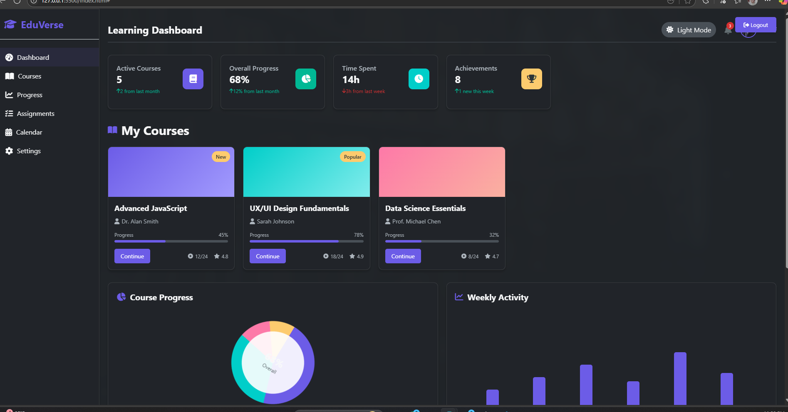 | 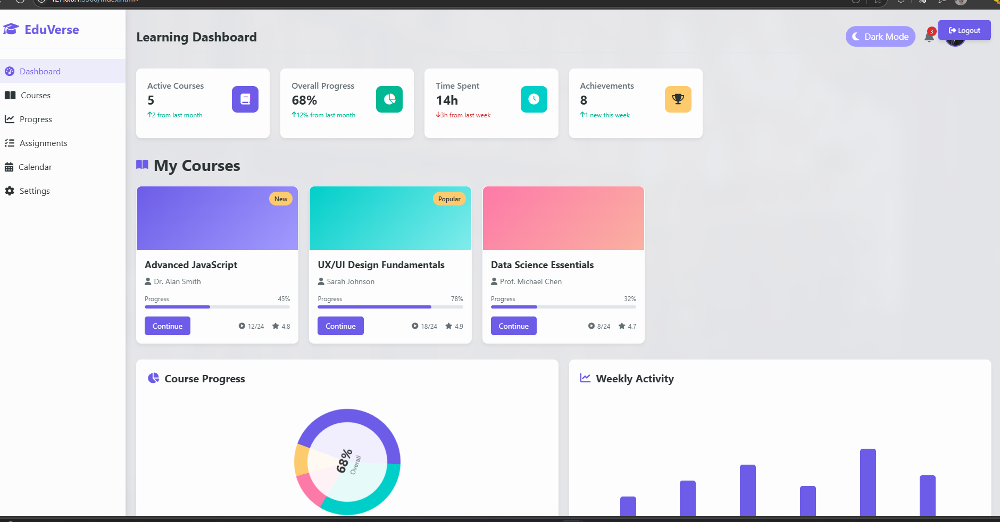 |
| *Stats cards · Active courses · Donut & bar charts* | *Identical layout in crisp light theme* |

| Dashboard (Dark) — Scrolled | |
|:-:|:-:|
| 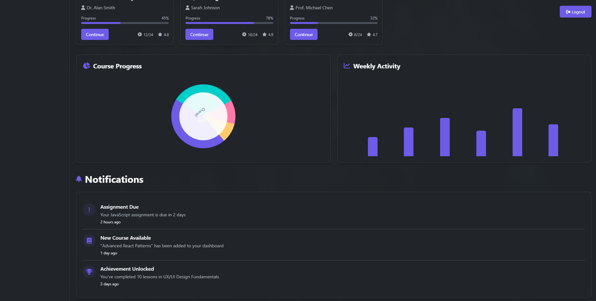 | |
| *Course Progress donut · Weekly Activity bar chart · Live Notifications feed* | |

---

### Courses & Course Detail

| All Courses Grid | Course Detail Modal (Light) |
|:-:|:-:|
| 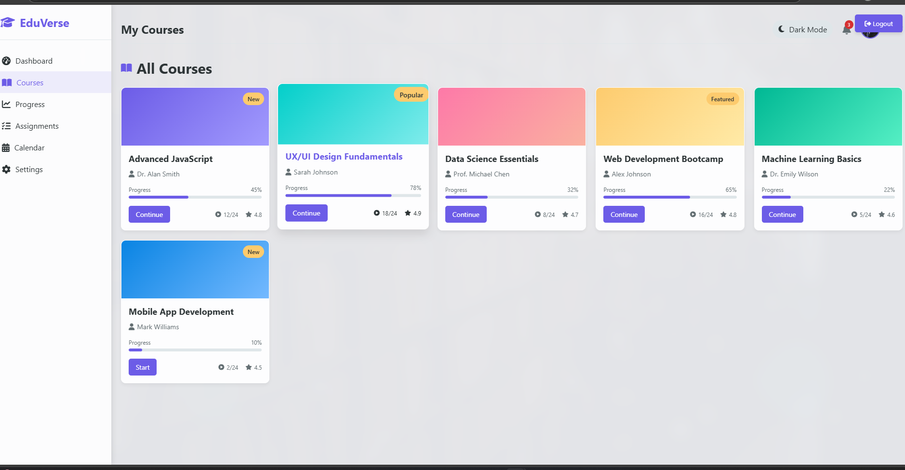 | 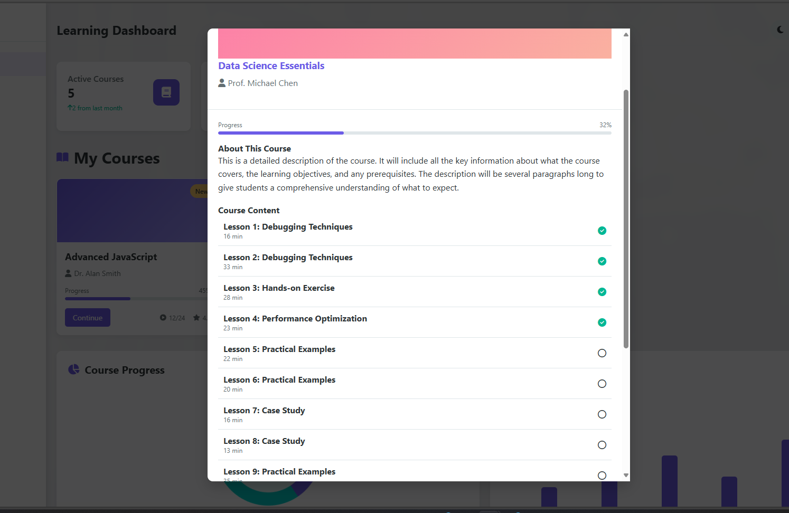 |
| *6 courses · New / Popular / Featured badges · Progress bars · Ratings* | *Data Science Essentials — lesson checklist, 32% progress bar* |

| Course Detail Modal (Dark) | |
|:-:|:-:|
| 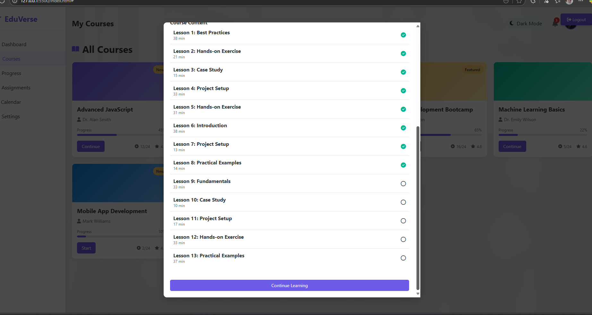 | |
| *Dark theme lesson list · Completion checkmarks · "Continue Learning" button* | |

---

### Progress & Analytics

| Learning Analytics (Light) | |
|:-:|:-:|
| 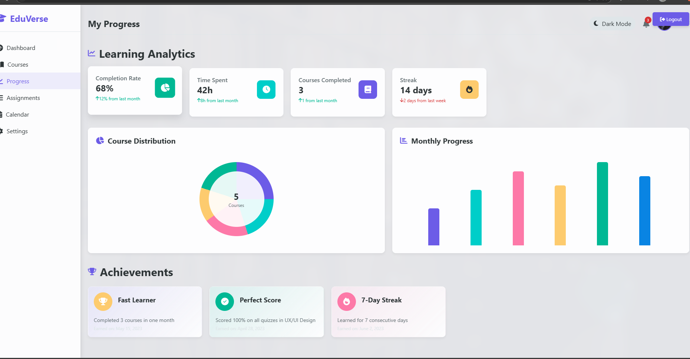 | |
| *68% completion · 42h total · 14-day streak · Course Distribution donut · Monthly Progress bars · 3 unlocked achievement badges* | |

---

### Assignments & Calendar

| Assignments | Learning Calendar |
|:-:|:-:|
| 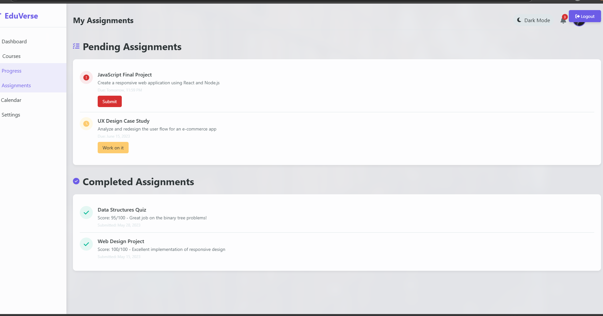 | 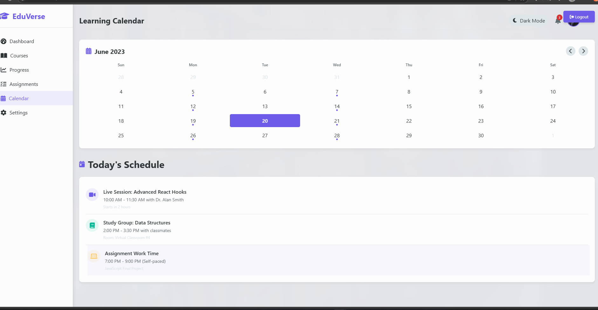 |
| *Pending assignments with due dates · Completed assignments with scores* | *Monthly calendar · Today's live session, study group & self-paced schedule* |

---

### Settings

| Account Settings (Light) | Account Settings (Dark) |
|:-:|:-:|
| 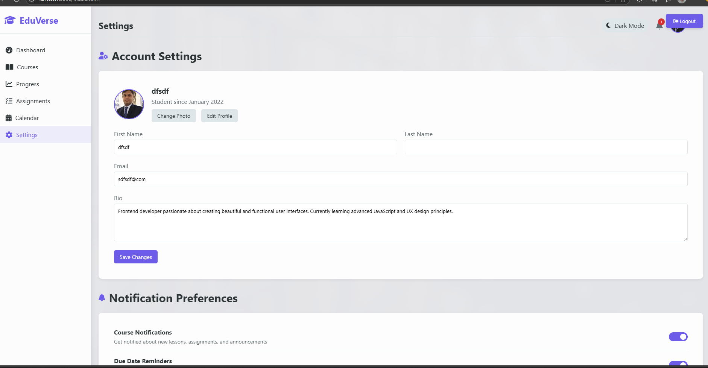 | 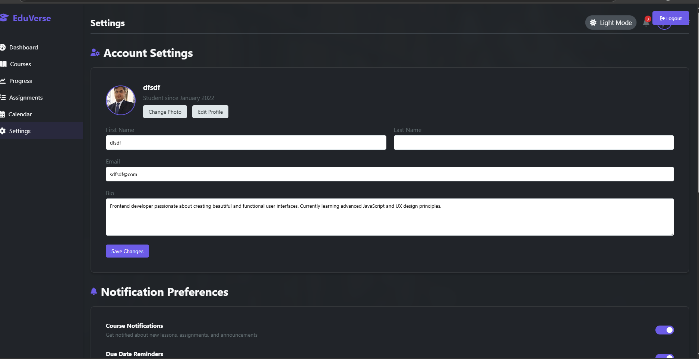 |
| *Profile photo · Name / Email / Bio form · Save Changes* | *Same settings panel in dark mode* |

| Notifications & Security | |
|:-:|:-:|
| 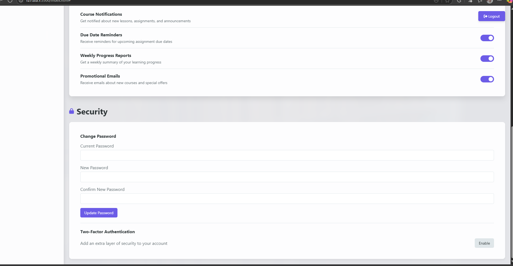 | |
| *Notification preference toggles · Change password form · Two-Factor Authentication enable* | |

---

### Auth Flows

| Login Modal | Logout Confirmation |
|:-:|:-:|
| 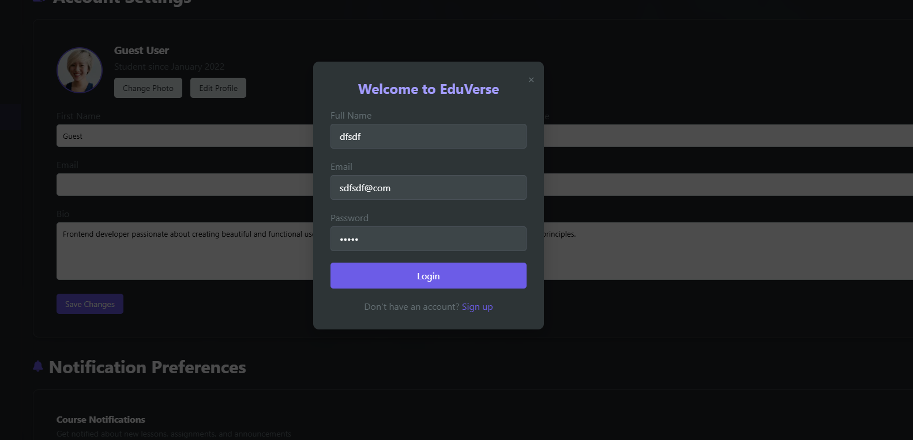 | 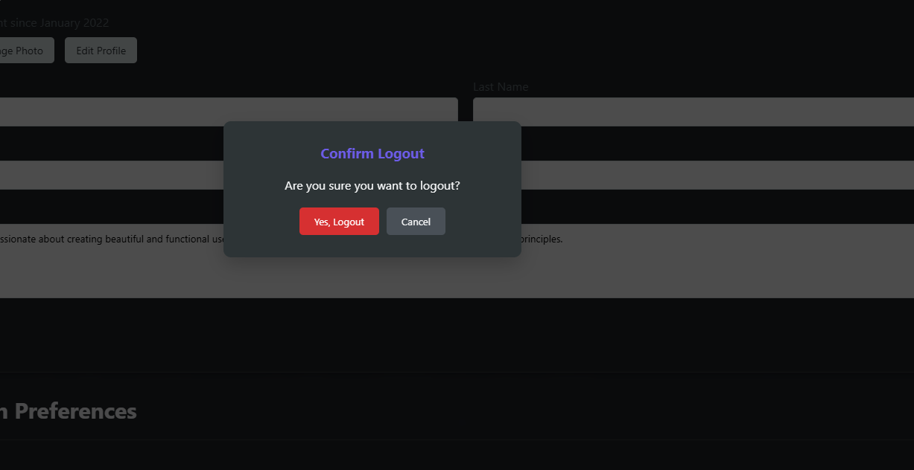 |
| *"Welcome to EduVerse" · Full Name, Email, Password · Sign Up link* | *Confirmation dialog prevents accidental logout* |

---

## 🧭 Navigation

EduVerse implements client-side SPA routing without any framework:

```javascript
// Section switching — no page reloads
function showSection(sectionId) {
  document.querySelectorAll('.section').forEach(s => s.classList.remove('active'));
  document.getElementById(sectionId).classList.add('active');
  document.querySelectorAll('.nav-item').forEach(n => n.classList.remove('active'));
}
```

Clicking any sidebar link shows the corresponding section while hiding all others — instant, zero-latency navigation.

---

## 📊 Charts

Charts are rendered using the browser's native **Canvas API** — no Chart.js, no D3:

```javascript
// Donut chart drawn with arc() paths and text overlay
function drawDonutChart(canvas, data, colors) {
  const ctx = canvas.getContext('2d');
  // ... arc segments + center label
}

// Bar chart with proportional column heights
function drawBarChart(canvas, data, colors) {
  const ctx = canvas.getContext('2d');
  // ... fillRect() bars with spacing
}
```

---

## 🤝 Contributing

Contributions, issues, and feature requests are welcome!

1. Fork the repository
2. Create your feature branch: `git checkout -b feature/AmazingFeature`
3. Commit your changes: `git commit -m 'feat: add AmazingFeature'`
4. Push to the branch: `git push origin feature/AmazingFeature`
5. Open a Pull Request

---

## 📄 License

Distributed under the MIT License. See [`LICENSE`](LICENSE) for more information.

---

<div align="center">

Made with ❤️ by [AnasQ2003](https://github.com/AnasQ2003)

⭐ If you find this project useful, please give it a star!

</div>
